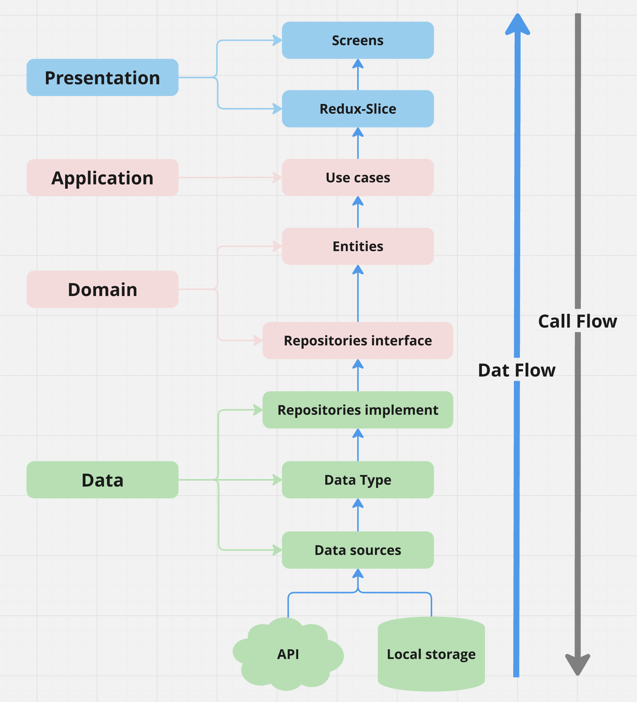

# React native clean achitecture

- [React native clean achitecture](#react-native-clean-achitecture)
  - [1. Clean achitecture](#1-clean-achitecture)
  - [2. Source Structure](#2-source-structure)
  - [3. Diagram](#3-diagram)
  - [4. Structure explanation](#4-structure-explanation)
    - [1. Presentaion layer](#1-presentaion-layer)
    - [2. Application layer](#2-application-layer)
    - [3. Domain layer](#3-domain-layer)
    - [4. Data layer](#4-data-layer)

## 1. Clean achitecture

Refer here => [Clean achitecture](https://quiver-blade-c45.notion.site/Clean-Architecture-feeff46260b94c58a013b6fc047cc0df#010e810803df4eb8b29ad1fa32cefa1e)

## 2. Source Structure

```jsx
src/
├── assets/
│   ├── icons/
│   ├── images/
├── constants/
│   ├── enum/
├── core/
│   ├── common/
│   ├── components/
│   ├── styles/
├── features/
│   ├── auth/
│   │   ├── application/  // Application layer
│   │   │   ├── LoginUseCase.ts
│   │   ├── data/  // Data layer
│   │   │   ├── repositories/
│   │   │   │   ├── authRespositoriesImpl.ts
│   │   │   ├── types/
│   │   │   │   ├── ILoginResponse.ts
│   │   ├── domain/  // Domain layer
│   │   │   ├── repositories/
│   │   │   │   ├── IAuthRepositories.ts
│   │   │   ├── entities/
│   │   │   │   ├── IUser.ts
│   │   ├── presentation/  // Presentation layer
│   │   │   ├── redux-slice/
│   │   │   │   ├── auth.slice.ts
│   │   │   │   ├── types.ts
│   │   │   ├── screens/
│   │   │   │   ├── SignInScreen.tsx
├── navigation/
│   ├── stacks/
├── network/
├── redux/
│   ├── slice/
│   ├── store.ts
├── utils/
├── main.tsx
```

## 3. Diagram



## 4. Structure explanation

### 1. Presentaion layer

```jsx
├── presentation/  // Presentation layer
│   ├── redux-slice/
│   │   ├── auth.slice.ts
│   │   ├── types.ts
│   ├── screens/
│   │   ├── SignInScreen.tsx
```

**Presentaion layer** bao gồm **redux-slice** **screens** và **components**

**Screens**
Chứa các màn hình.
Không xử lý logic trong screen.

**Redux-slice**
Có thể là một _redux slice_ cho cả feature, hoặc các _redux slice_ cho các màn hình có state hoặc phần xử lý phức tạp.
_Redux slice_ chứa _state_, các phần xử lý logic và call api.
Chuyển hết các _state_ sang _redux slice_ nếu có thể.
File type là nơi khai báo type _state_ của _redux slice_, type đầu vào của các _func_ trong _redux slice_.

**Components**
Chứa các components dùng chung của feature ở ví dụ trên là các components chỉ đươc dùng chung tại feature auth.
Các components dùng chung trên toàn app sẽ nằm ở folder **core/components**

### 2. Application layer

```jsx
├── application/  // Application layer
│   ├── LoginUseCase.ts
```

**Application layer** bao gồm các **use cases**, lớp này có thể là optional.

**Usecases**
Đây là các lớp hoặc chức năng chính của ứng dụng, thực hiện các nghiệp vụ cụ thể. Các Use Cases không nên biết bất kỳ chi tiết cụ thể nào về giao diện người dùng hay các nền tảng cụ thể. Chúng chỉ nên tập trung vào việc xử lý business logic và sử dụng các entities.
Ví dụ như trong LoginUseCase sẽ hàm login của repositores của Data layer và trả về User entity nếu thành công.

### 3. Domain layer

```jsx
├── domain/  // Domain layer
│   ├── repositories/
│   │   ├── IAuthRepositories.ts
│   ├── entities/
│   │   ├── IUser.ts
```

**Domain layer** bao gồm **repositories** và **types**

**Repositories**
là các interface đại diện cho việc truy xuất dữ liệu từ các nguồn khác nhau như cơ sở dữ liệu, API, bộ nhớ cache, v.v. Chúng cung cấp một cách tiếp cận trừu tượng đối với dữ liệu để các Use Cases có thể tương tác với dữ liệu mà không phụ thuộc vào cụ thể của từng nguồn dữ liệu.
Là một interface định nghĩa các func chức năng như login, dạng tham số đầu vào và dạng dữ liệu trả về của chức năng.

**Entities**
Có thể là type hoặc interface chính là entities trong _Clean Achitecture_. Ở auth feature thì nó chính là type hoặc interface của User.

### 4. Data layer

```jsx
├── data/  // Data layer
│   ├── repositories/
│   │   ├── authRespositoriesImpl.ts
│   ├── types/
│   │   ├── ILoginResponse.ts
```

**Data layer** bao gồm **repositories** và **types**

**Repositories**
Là một class implements repositories interface của Domain layer chứa các func chức năng để làm việc với các nguồn khác nhau như cơ sở dữ liệu, API, bộ nhớ cache, v.v.

**Types**
Có thể là type hoặc interface định nghĩa các kiểu dữ liệu đươc phía BE hay local storage trả về.
Ở ví dụ về auth feature thì là một interface khai báo kiểu dữ liệu trả về từ BE tại api login.
